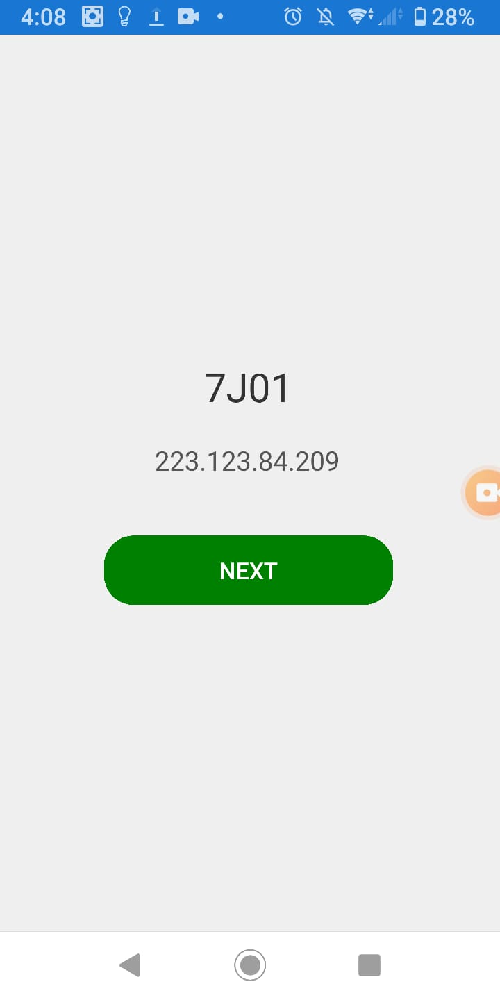
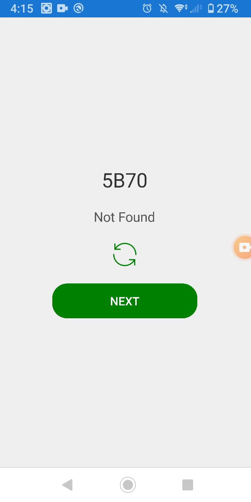

## NetworkCodeAuthentication

## Important Note
1. I tested only on Android , as I have windows PC
2. I was unable to test on multiple emulators, due to the low RAM of PC I have to run multiple Visual Studio Projects and emulators, Any way while testing I recorded the video Here is a link to vides
**Video Link**
<https://drive.google.com/file/d/1e6l94k3LJmJtDLaz3bqDrTz6punvXLSR/view>

#Basic Setups
Project Uses xamarin forms and Asp .net core web api for communicationg with SQL
xamarin forms project and web api projects are in the same solution.

##****Xamarin Forms Project**
Project uses MVVM pattern and some services and helper
There is a networkservice for communicationg with api's(database)
There is a navigationservice that is implemented for page navigation purpose and registering viewmodels against views in this way we can navigating through viewmodels easily.
For showing toast messages some native functionality is also implemented in AppServices class by the help of IMessage interface that has implementation in each platform.

**Views And ViewModels**
We have three views first is StartUpview with Startup ViewModel, second is ValidationView with ValidationViewModel and third is WelcomeView with WelcomViewModel.
**First Page**
At first Page Four are three controls lable for showing random four digit controls, label for Ip Address of the computer,refesh button(invisible) and Next Button.
At first page application loads and make search for the IP address of the computer by API, until app IP is found there is text "Searching network..." in lable text, if IP found that is shown in label text other wise it shows "Not Found" and Refresh button is visible to make search again no need to satrt the app again.
On pressing Next button it saves the IP address and random Code into the SQL database by APi

**Second Page**
Second page provide us with three Four Controls, A lable showing that enter the code to play, A Entry for entering the random code that we get on page1
and two buttons first is Submit and second is back
(As second page loads it agains get the IP address of the computer by Api)
Back Button moves to the page1
Submit button Sends the IP address and code entered in entry to the database by API for verification as if We are connected to the same Network and moves to the page3 whtich is Welcome Page

**Third Page**
If the submitted IP addrss and code are presented in database , Then we find a random User Name from Database by API and we move to the third page where it shows Welcome(UserName!)

**WebApi Projec**
Web api project gives us IP address of the computer on which computer is running on, we are getting this by <https://api.ipify.org?format=json> we can get this by HttpContext but in that case we will get the IP address of android device is running on.

Project uses Conveyor extesion to consume local web api over mobile devices. Here is the swagger end point screen short.

**Database**
Database script is in database folder
